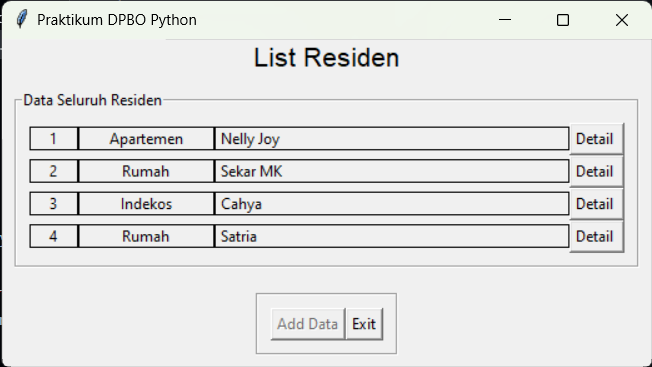
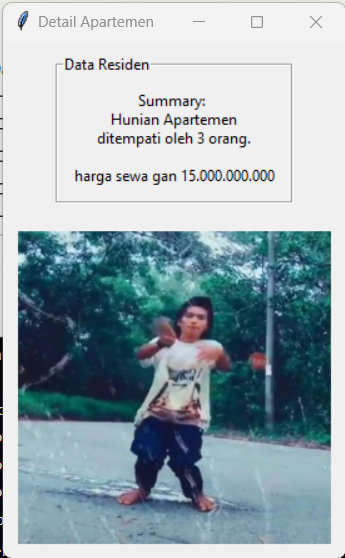

# LP9DPBO2023C2

## Janji
Saya Nadhief Athallah Isya dengan NIM 2106413 mengerjakan LP9 Praktikum DPBO dalam mata kuliah Desain Pemrograman Berorientasi Objek untuk keberkahan-Nya maka saya tidak melakukan kecurangan seperti yang telah dispesifikasikan. Aamiin.

## Requirement Soal
Latihan Praktikum tidak menggunakan Database, tapi harus mengirim bukti screenshot menjalankan contoh kode yang dikirim.
Spesifikasi:
1. Lengkapi fitur summary
2. Buat landing Page (button yg ngarah ke halaman daftar residen)
3. Tampilin gambar
4. Tambahin 1 metode yang masih relevan untuk setiap kelas
Kalau mau bikin dari awal sendiri:
1. Landing Page juga
2. Minimal menggunakan 4 kelas
3. Tampilin gambar
4. Semua data kelas harus ditampilkan
5. Buat diagram kelas di readme

## Alur Program
1. Tekan List Residen untuk pergi ke halaman tabel residen
2. Tekan detail untuk melihat detail data residen
3. Tekan exit untuk mengakhiri program

## Dokumentasi

## Bukti Coba Db

